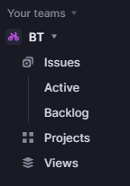

## 리니어

[linear](https://linear.app/) 공식페이지

- Linear은 23년도 9월 시리즈 B를 미국 최고의 투자 기업인 Accel이 리드하고, Slack,Stripe,Vercel CEO들이 개인투자자로 참여하는 화려한 라인업을 자랑하며, 470억 규모의 투자를 유치했습니다.

### Linear Method

- PM들은 각자 회사의 환경이 다르고, 일하는 사람이 다르기에 100명의 PM이면 100가지의 프로젝트 관리방법이 있습니다.
- Linear에서 지원하는 Linear Method는 이러한 다양한 환경에서도 공통적으로 지켜져야 할 핵심 원칙과 제품을 만드는 사람이라면 생각해봐야 할 지점들이 담겨있습니다.

#### Write issues, not user stories

- 사용자 스토리가 아닌 이슈 작성
- Linear에서 이슈를 생성할 때 유일한 요구 사항은 제목, 팀, 백로그나 할 일과 같은 상태를 추가하는 것입니다.
- 이슈를 작성할 때 우리는 이슈를 가능한 한 작게 분류하여 단일 소유자에게 할당합니다.

#### Prioritize projects

- 프로젝트 우선순위 지정
- 초점이 없으면 목표를 향해 나아가지 못하는 문제를 해결하기가 쉬울 수 있습니다.

#### Roadmap

- 로드맵
- 로드맵에 따라 작업하여 방향과 우선순위를 조정합니다.

#### Work in cycles

- 사이클적인 작업
- 프로젝트는 일반적으로 분기 및 제품에 대한 초점과 우선순위를 반영하지만, 사이클을 사용하여 특정 기간동안 작업할 특정 이슈가 무엇인지 파악합니다.

### 간단한 사용방법

- Issues = 특정 일정 관리들을 위한 작성 공간
- Active = 현재 진행중인 Issue를 확인할 수 있다.
- Backlog = 진행해야할 특정 Issue를 확인할 수 있다.
- Projects = 프로젝트를 생성하여 진행중이거나 진행해야될 Issue를 추가해서 관리할 수 있다.
- Views = 사용자가 보고 싶어하는 이슈나 프로젝트만을 설정해서 볼 수 있다.

#### 초기 세팅하기

- 레퍼지토리 연결하기

1. 왼쪽 위 버튼을 클릭하여 Setting 클릭
2. Setting 입장 후 왼쪽 사이드 바에서 Working Space 제일 마지막 Integrations 클릭
3. Integrations에서 Linear Crafted 중 Github 클릭(원하는 다른 특정 사이트 연결도 가능/slack,gitlab,figma 등등)
4. 깃허브 연결시 연결할 본인 계정과 연결 후 사용할 repository 연결
   > > > 주의할 점: 무료 계정 이용시 본인이 주인(owner)인 다른 repository와 연결 한 적이 없는 깃허브 Organizations에 연결할 것 - 무료계정은 하나만 연결 가능한 것 같다.
5. 연결이 됐는지 확인 후 연결된 repository를 remote해서 사용하면 된다.

#### 사용법 - 간단한 예시(github사용, 팀과 식별자 = JS)

1. Backlog에서 오른쪽 위 + 버튼(Add issue)를 눌러 issue를 추가한다.
2. issue title과 Add description을 작성 후 create issue를 눌러 이슈를 작성한다.
3. 그 후 vscode에서 Linear와 연결된 github repository를 remote해줘 연결한다.
4. Backlog에 작성한 목표를 완료 후 branch를 git checkout -b JS-1-@@@@(@=추가하고 싶은 branch명)을 넣어 branch를 생성과 변경을 동시에 해준다.
5. 그 후 git add . -> git commit -m "@@" -> git push origin JS-1-@@@@을 입력해 Github에 push를 해준다.
6. Github로 이동하여 pr을 날려 Linear의 JS-1이 진행중인지 확인해줍니다. - Active로 이동하거나 myissue에서 상태가 In Progress(진행중)으로 노란색이 절반정도 찬 원이 되면 된겁니다.
7. 진행을 확인 후 메인에 머지하면 Linear에 진행사항이 파란색 원에 체크표시가 된채로 Done(완료)로 변경된다.

이로써 간단한 Linear 이용방법을 설명했습니다.

장점 : 실시간으로 완료된 진행사항을 자동으로 체크가 된다는 점에서 편리한 협업툴입니다.

단점 : 이제 막 떠오르는 협업툴이여서 그런가 구글링을 해도 정보가 많이 있지는 않았고, 유일하게 참고할만한 곳이 Linear에서 제공하는 공식문서뿐이다.
