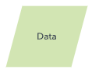

## 흐름도

#### 흐름도란?

- 데이터 흐름을 시각적으로 나타내는 흐름도는 프로그램이나 알고리즘을 작성하고 이를 다른 사람이나 협업자에게 설명할 때 유용합니다.
- 자동화된 프로세스의 코딩을 시작하기 전에 알고리즘 흐름도를 사용하여 프로그램의 로직을 설명할 수 있습니다.
- 알고리즘 흐름도는 큰 그림을 정리하고 코딩할 시점에 대한 가이드를 제공할 수 있습니다.

#### 터미널/터미네이터

- Flow Chart의 시작과 끝을 표시한다

#### 프로세스

- 모든 처리 과정을 표시. 기호 내에 처리 내용을 기입한다.

#### 의사결정

- 조건에 따라 분기되는 Case를 표시한다.

#### 데이터 입력 또는 출력

- 모든 종류의 입력과 출력을 표시한다.

#### 문서

- 액션이후 표시되는 문구를 나타낼 때 많이 사용한다.

#### 화살표

- 각 기호간의 연결 관계를 나타낸다.

### 플로우 차트를 그리는 규칙

1. 다이어그램의 정해진 용도에 맞춰 작성한다.
2. 위에서 아래로 하며 별도의 케이스가 있다면 화살표를 통해 순서를 표시한다.
3. 취소 케이스의 경우 구분이 가도록 아래쪽으로 그리는 것이 좋다.

### BT조직도

[BT조직도](https://drive.google.com/file/d/1jVGymehbScB6eDT1dx2gxA7iz-GWu58o/view?usp=sharing)
